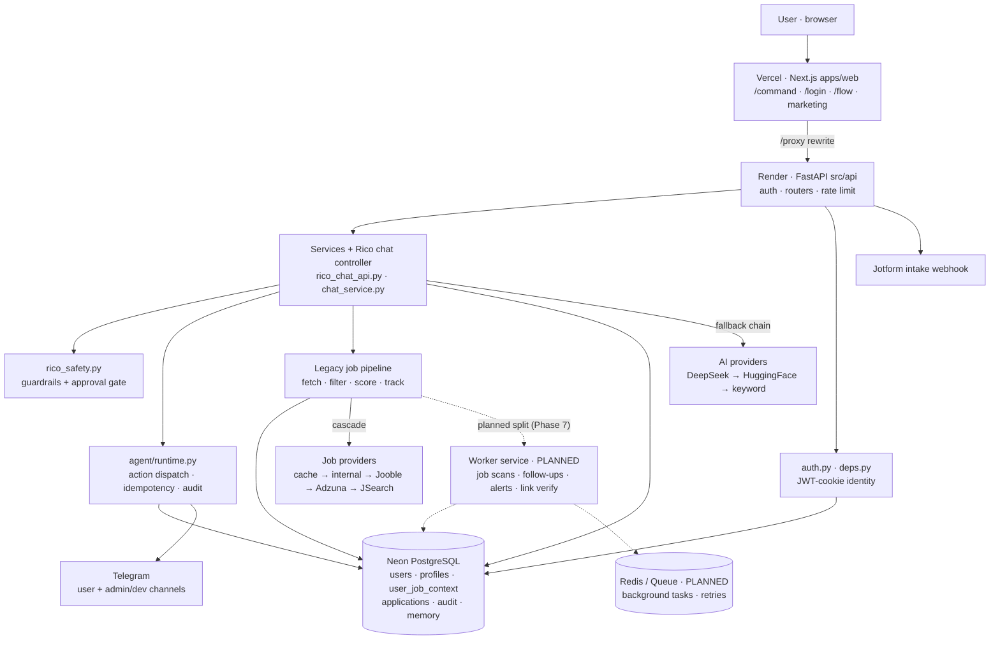

# Architecture

## Current live stack

- Frontend: Next.js 14 / TypeScript / Tailwind in `apps/web`
- Backend: Python / FastAPI in `src/api`
- Database: Neon PostgreSQL
- Backend deployment: Render
- Frontend deployment: Vercel
- Job search API: JSearch / RapidAPI
- Notifications: Telegram
- Intake fallback: Jotform
- AI providers: OpenAI -> DeepSeek -> HuggingFace -> Keyword Fallback

## Current high-level flow

```text
apps/web frontend
        ↓
FastAPI app in src/api
        ↓
API routers + services
        ↓
Rico chat / jobs / applications / profile / settings / actions
        ↓
Rico conversational layer + agent runtime + legacy job pipeline
        ↓
Neon PostgreSQL + Telegram + dashboard/report output
```

## System diagram (live stack + data flow)

Text-based (Mermaid) so it diffs in Git and cannot silently rot. This is the
**current** production topology; the worker/queue split below in "Target
architecture" is a planned end-state, not deployed.



The **legacy job pipeline** currently runs in-process (daily bot / `run_daily.py`).
The dashed **Worker service** + **Redis/Queue** are the planned Phase-7 separation
(DEC-20260707-001 PRs D/E) — not deployed. Render stays production until then.

Notes:
- `/chat` and `/orchestrate` redirect to `/command` (see `CURRENT_STATE.md` route
  table + No Dead UI Rule, DEC-20260628-001).
- The active AI provider is env-controlled (`RICO_AI_PROVIDER`, currently
  `deepseek`); see CLAUDE.md → "AI Provider Routing".
- Neon is the single source of truth for durable state; nothing user-critical
  lives only in process memory or on Render disk.

## Repository layers

1. Legacy job automation pipeline
   - job fetching
   - filtering
   - scoring
   - application tracking
   - Telegram notifications
   - dashboard/report generation
   - follow-up reminders

2. Rico AI backend
   - FastAPI app
   - chat routes
   - public chat
   - CV upload and parsing
   - onboarding
   - auth
   - user isolation
   - Jotform and Telegram webhooks
   - provider fallback behavior

3. SaaS frontend
   - public landing page
   - `/chat`
   - `/signup`
   - `/login`
   - `/forgot-password`
   - `/dashboard`
   - `/jobs`
   - `/applications`
   - `/profile`
   - `/settings`
   - `/onboarding`

> The list above is the historical product-surface map, not the live routing
> contract. `/chat` redirects to `/command` (the primary chat surface), and
> several routes above are redirect-only or pending a product decision. For the
> authoritative per-route state see the **Route architecture** table in
> `AI_WORKSPACE/CURRENT_STATE.md` and the **No Dead UI Rule** (DEC-20260628-001).

## Key backend files

- `src/api/app.py` — main FastAPI app used by Render
- `src/api/auth.py` — login, logout, register, forgot/reset password, `/me`
- `src/api/deps.py` — JWT/current-user dependencies
- `src/api/rate_limit.py` — SlowAPI limits
- `src/api/routers/rico_chat.py` — Rico chat, public chat, CV upload, webhooks
- `src/api/routers/onboarding.py` — structured onboarding submit
- `src/api/routers/jobs.py` — jobs API
- `src/api/routers/applications.py` — applications API
- `src/api/routers/settings.py` — settings API
- `src/api/routers/stats.py` — stats/dashboard API
- `src/api/routers/user.py` — profile retrieval/update
- `src/api/routers/actions.py` — idempotent job actions
- `src/api/routers/agent.py` — natural-language chat with Rico agent
- `src/api/routers/pipeline.py` — pipeline status/trigger
- `src/rico_jotform_webhook.py` — Jotform processing and idempotency
- `src/rico_telegram_webhook.py` — Telegram webhook processing
- `src/rico_db.py` — Rico DB helper
- `src/rico_chat_api.py` — primary conversational layer
- `src/rico_safety.py` — guardrails
- `src/rico_repo_adapter.py` — bridge between agent layer and legacy pipeline
- `src/agent/runtime.py` — central action dispatcher
- `src/agent/registry/tool_registry.py` — declarative tool system
- `src/services/chat_service.py` — chat business logic
- `src/db.py` — DB connection layer
- `src/repositories/*` — repository layer
- `src/run_daily.py` — daily job bot / intelligence pipeline

## Key frontend files

- `apps/web/app/command/page.tsx` — public chat UI (primary chat surface; `/chat` redirects here)
- `apps/web/app/signup/page.tsx` — self-signup UI
- `apps/web/app/login/page.tsx` — login UI
- `apps/web/app/onboarding/page.tsx` — guided onboarding / CV-first flow
- `apps/web/lib/api.ts` — canonical frontend API helper
- `apps/web/services/*` — older service wrappers

## Target architecture (phased maturation)

Rico is maturing from a job board into an **AI career operator**. The current stack is valid but
mixes request handling, temporary chat memory, and the job-search script in one process, and has
historically relied on Render's ephemeral disk for state that must be durable. See
`DECISIONS.md` → DEC-20260707-001 for the full decision and rationale.

> Status: **approved roadmap, implementation not started.** The end-state below is the target,
> not what is deployed today. The production backend is still FastAPI on **Render** (see
> "Current live stack" at the top of this file). Railway, the separate worker service, and
> Redis/Queue do **not** yet exist in production. Render remains production until Railway passes
> full production smoke testing.
>
> Near-term execution gate: read `AI_WORKSPACE/AUDITS/2026-07-08-production-hardening-audit.md`
> **before** starting any feature, redesign, worker, notification, or infrastructure work. That
> production hardening audit — centered on operational memory — is the immediate stabilization
> authority; this target architecture is the higher-level roadmap it feeds into. Phase 1 below
> ("persist job context + apply links") is **verify-first**: the persistence layer already exists
> on `main`, so prove the audit's Phase 2 gaps with synthetic data and fix only proven gaps — do
> not rebuild persistence. No real-user smoke or mutation without explicit owner approval.

Target end-state (reached in ordered phases, not a big-bang migration):

```text
Vercel            Next.js frontend
API service       FastAPI (requests only): Rico chat controller, auth/session, job/application API
Worker service    job scans, follow-up checks, alerts, link verification, scheduled tasks
Neon              users, profiles, job_context, applications, memory, billing/subscription
Redis / Queue     background tasks, retries, rate guards
Telegram / Email  notifications only
```

Principles:
- Separate API from worker logic (FastAPI serves requests only; workers own background/scheduled work).
- Neon is the single source of truth — persist job search results, apply links, application state,
  target role, chat-derived preferences, and follow-up state. No important state lives only in
  memory or on Render disk.
- Keep the Vercel frontend; move the backend to Railway first (Cloud Run later if scale grows).
- Do not redesign the UI while operational state is unstable.

Phase / PR order (each an independently reviewable slice from current `main`). State reliability
is the highest current risk, so persistence and application lifecycle precede API consolidation.
See `DECISIONS.md` → DEC-20260707-001 for per-phase success criteria.

1. Persist job context + apply links (PR A) — top-priority reliability fix
2. Application lifecycle cleanup (PR B)
3. API / client consolidation (PR C)
4. Worker / cron separation (PR D)
5. Move backend from Render to Railway (PR E) — Render stays production until Railway passes full smoke
6. Add monitoring / logging (PR F)
7. UI redesign (PR G) — only after 1–6 land

## Architecture rules

- Preserve the existing Rico architecture unless the task explicitly approves changing it.
- Do not add parallel implementations that conflict with current `main`.
- Keep protected routes based on JWT-derived identity, not request-body `user_id`.
- Keep user-impacting actions permission-based.
- Do not claim production readiness without tests, deployment verification, and smoke evidence.
