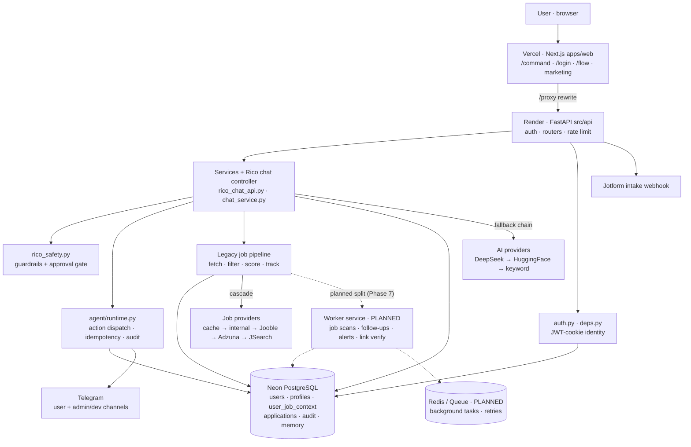

# Architecture

## Document contract

- **Why it exists:** one description of how Rico is built, how it is intended to
  become, and the structural rules that govern movement between the two.
- **Update when:** a structural boundary, contract, or migration rule changes —
  not when a PR merges. Per-PR narrative belongs in `PROJECT_STATUS.md` and
  `TASKS.md`; the forward slice order belongs in `ENGINEERING_ROADMAP.md`.
- **Source of truth:** this file for structure and architecture rules;
  `DECISIONS.md` for binding decisions; `PROJECT_STATUS.md` + live `main` for
  current control state, which wins over any snapshot here.
- **Owner:** Rico owner, with the acting CTO/session responsible for keeping the
  rules below consistent with what the code actually does.
- **History:** superseded diagrams and rules stay in Git history and are not
  duplicated inline.

## Current live stack

- Frontend: Next.js 14 / TypeScript / Tailwind in `apps/web`
- Backend: Python / FastAPI in `src/api`
- Database: Neon PostgreSQL
- Backend deployment: **Railway** — service `rico-api`, canonical URL
  `https://api.ricohunt.com`. Verified from the Railway console 2026-07-30:
  custom domain Active/Verified, `GET /health` 200 with `Server: railway-hikari`
  and `x-railway-edge` present, `GET /version` 200, and
  `https://ricohunt.com/proxy/health` 200 carrying Railway headers (so the
  Vercel proxy reaches Railway). Render no longer serves production.
- Frontend deployment: Vercel
- Job search API: JSearch / RapidAPI
- Notifications: Telegram
- Intake fallback: Jotform
- AI providers: OpenAI -> DeepSeek -> HuggingFace -> Keyword Fallback

## Current high-level flow

```text
apps/web frontend
        ↓
FastAPI app in src/api
        ↓
API routers + services
        ↓
Rico chat / jobs / applications / profile / settings / actions
        ↓
Rico conversational layer + agent runtime + legacy job pipeline
        ↓
Neon PostgreSQL + Telegram + dashboard/report output
```

## System diagram (live stack + data flow)

Text-based (Mermaid) so it diffs in Git and cannot silently rot. This is the
**current** production topology; the worker/queue split below in "Target
architecture" is a planned end-state, not deployed.


```mermaid
flowchart TD
    U[User · browser] --> FE[Vercel · Next.js apps/web<br/>/command · /login · /flow · marketing]
    FE -->|/proxy rewrite| API[Render · FastAPI src/api<br/>auth · routers · rate limit]

    API --> SVC[Services + Rico chat controller<br/>rico_chat_api.py · chat_service.py]
    API --> AUTH[auth.py · deps.py<br/>JWT-cookie identity]

    SVC --> SAFE[rico_safety.py<br/>guardrails + approval gate]
    SVC --> RT[agent/runtime.py<br/>action dispatch · idempotency · audit]
    SVC --> PIPE[Legacy job pipeline<br/>fetch · filter · score · track]

    RT --> DB[(Neon PostgreSQL<br/>users · profiles · user_job_context<br/>applications · audit · memory)]
    PIPE --> DB
    AUTH --> DB
    SVC --> DB

    SVC -->|fallback chain| AI[AI providers<br/>DeepSeek → HuggingFace → keyword]
    PIPE -->|cascade| JOBS[Job providers<br/>cache → internal → Jooble → Adzuna → JSearch]
    RT --> TG[Telegram<br/>user + admin/dev channels]
    API --> JF[Jotform intake webhook]

    PIPE -. "planned split (Phase 7)" .-> WK[Worker service · PLANNED<br/>job scans · follow-ups · alerts · link verify]
    WK -.-> DB
    WK -.-> RQ[(Redis / Queue · PLANNED<br/>background tasks · retries)]
```

The **legacy job pipeline** currently runs in-process (daily bot / `run_daily.py`).
The dashed **Worker service** + **Redis/Queue** are the planned Phase-7 separation
(DEC-20260707-001 PRs D/E) — not deployed. Render stays production until then.

Notes:
- `/chat` and `/orchestrate` redirect to `/command` (see `CURRENT_STATE.md` route
  table + No Dead UI Rule, DEC-20260628-001).
- The active AI provider is env-controlled (`RICO_AI_PROVIDER`, currently
  `deepseek`); see CLAUDE.md → "AI Provider Routing".
- Neon is the single source of truth for durable state; nothing user-critical
  lives only in process memory or on Render disk.

## Repository layers

1. Legacy job automation pipeline
   - job fetching
   - filtering
   - scoring
   - application tracking
   - Telegram notifications
   - dashboard/report generation
   - follow-up reminders

2. Rico AI backend
   - FastAPI app
   - chat routes
   - public chat
   - CV upload and parsing
   - onboarding
   - auth
   - user isolation
   - Jotform and Telegram webhooks
   - provider fallback behavior

3. SaaS frontend
   - public landing page
   - `/chat`
   - `/signup`
   - `/login`
   - `/forgot-password`
   - `/dashboard`
   - `/jobs`
   - `/applications`
   - `/profile`
   - `/settings`
   - `/onboarding`

> The list above is the historical product-surface map, not the live routing
> contract. `/chat` redirects to `/command` (the primary chat surface), and
> several routes above are redirect-only or pending a product decision. For the
> authoritative per-route state see the **Route architecture** table in
> `AI_WORKSPACE/CURRENT_STATE.md` and the **No Dead UI Rule** (DEC-20260628-001).

## Key backend files

- `src/api/app.py` — main FastAPI app used by Render
- `src/api/auth.py` — login, logout, register, forgot/reset password, `/me`
- `src/api/deps.py` — JWT/current-user dependencies
- `src/api/rate_limit.py` — SlowAPI limits
- `src/api/routers/rico_chat.py` — Rico chat, public chat, CV upload, webhooks
- `src/api/routers/onboarding.py` — structured onboarding submit
- `src/api/routers/jobs.py` — jobs API
- `src/api/routers/applications.py` — applications API
- `src/api/routers/settings.py` — settings API
- `src/api/routers/stats.py` — stats/dashboard API
- `src/api/routers/user.py` — profile retrieval/update
- `src/api/routers/actions.py` — idempotent job actions
- `src/api/routers/agent.py` — natural-language chat with Rico agent
- `src/api/routers/pipeline.py` — pipeline status/trigger
- `src/rico_jotform_webhook.py` — Jotform processing and idempotency
- `src/rico_telegram_webhook.py` — Telegram webhook processing
- `src/rico_db.py` — Rico DB helper
- `src/rico_chat_api.py` — primary conversational layer
- `src/rico_safety.py` — guardrails
- `src/rico_repo_adapter.py` — bridge between agent layer and legacy pipeline
- `src/agent/runtime.py` — central action dispatcher
- `src/agent/registry/tool_registry.py` — declarative tool system
- `src/services/chat_service.py` — chat business logic
- `src/db.py` — DB connection layer
- `src/repositories/*` — repository layer
- `src/run_daily.py` — daily job bot / intelligence pipeline

## Key frontend files

- `apps/web/app/command/page.tsx` — public chat UI (primary chat surface; `/chat` redirects here)
- `apps/web/app/signup/page.tsx` — self-signup UI
- `apps/web/app/login/page.tsx` — login UI
- `apps/web/app/onboarding/page.tsx` — guided onboarding / CV-first flow
- `apps/web/lib/api.ts` — canonical frontend API helper
- `apps/web/services/*` — older service wrappers

## Target architecture (phased maturation)

Rico is maturing from a job board into an **AI career operator**. The current stack is valid but
mixes request handling, temporary chat memory, and the job-search script in one process, and has
historically relied on Render's ephemeral disk for state that must be durable. See
`DECISIONS.md` → DEC-20260707-001 for the full decision and rationale.

> Status: **approved roadmap; implementation has begun, and the infrastructure end-state has not.**
> That distinction matters and the previous "implementation not started" wording erased it.
>
> **Milestone A landed as its first slice:** `#1399` — the documents inventory contract
> (`src/domain/documents`), merged as `fc2e107d`, deployed and verified. It is one statement of
> which documents a user has and which one is the active CV, adopted at a single wiring site
> (`src/api/routers/files.py`) with no behaviour change. Two known divergences from the legacy
> profile-CV rule are held as characterisation tests plus one strict xfail
> (`tests/unit/test_document_inventory_contract.py`); unifying that rule is a later slice and has
> not started.
>
> **The external job-search boundary now has a domain contract too:** `#1416`, merged as
> `dac8d8e7`, deployed and verified. `src/domain/job_search` states what a verified search result
> is (`SearchExecutionEvidence`, `VerifiedJobListing`, `VerifiedJobSearchBundle`), and
> `src/services/verified_job_search.py` is the seam that applies the integrity gate once before
> building a bundle. **One adopter: `_target_role_search_response`.** Ten other `job_matches`
> builders still name jobs without a bundle — adopting them is a later slice and has not started,
> so this is one boundary contracted, not the chat surface migrated.
>
> **That boundary was then made fail-closed:** `#1419` (PR2), merged as `1ea1d973` — routing refuses
> rather than guesses, and delivery is buffered so a partial result is never presented as a complete
> one. `#1421` (`3f2805de`) corrected the degraded early-exit lifecycle state that surfaced with it.
>
> **The CV surface has a truthfulness invariant but not yet a boundary:** `#1422`, merged as
> `c64aa99`, then extended to the files surface by `#1425` (`39b44696`) and to CV-analysis routing
> by `#1426` (`383dcb6c`). See "The CV read-truthfulness invariant" below. It is a behaviour
> contract enforced by guards *inside* `src/rico_chat_api.py` and at the `files.py` route, not a
> module boundary — no `src/domain/cv` exists, and none is authorized. Read it as one invariant
> made true at three consumers, not as the CV surface migrated. `#1424` (`594a4d3b`) characterized
> the Journey-1 CV routing on the untouched tree, which satisfies the pre-extraction requirement in
> "Migration rules for `rico_chat_api.py`" **for those paths only — and satisfying it is not
> authorization to extract.**
>
> **Backend hosting has moved to Railway; the rest of the infrastructure end-state below is still
> untouched.** The production backend is FastAPI on **Railway** (service `rico-api`,
> `https://api.ricohunt.com`) — see "Current live stack" at the top of this file for the verifying
> evidence. The separate worker service and Redis/Queue still do **not** exist in production.
> Read "implementation has begun" as two domain contracts in place plus a completed hosting move,
> not as the wider migration being under way.
>
> **How the move was discovered, and what it cost.** This document previously stated that Render
> remained production. That was stale, and the staleness was not merely cosmetic: two workflows
> (`deploy-render.yml`, `deploy-production.yml`) still targeted the retired Render host, which had
> stopped serving. They returned 409 and 503 on every `src/**` push, which made the commit's
> aggregate GitHub check suite fail, which made Railway's "Wait for CI" gate skip the deployment
> with "CI check suite failed". Production therefore sat on `ccde2c48` while `main` moved on, and
> the Phase 1 grounding merge `41a95ad` never shipped. **A verification workflow pointed at
> infrastructure that no longer serves does not just report a false red — through aggregate CI
> gating it stops the real host from ever deploying.** Repaired by retiring the deploy-hook
> workflow and repointing production verification at `https://api.ricohunt.com`, with a
> deterministic guard in `tests/test_deployment_gate_targets.py`.
>
> **Known remaining drift, tracked separately, NOT fixed here:** the frontend CSP still references
> `https://rico-job-automation-api.onrender.com`; `keep-warm.yml` and `render-audit.yml` still ping
> the retired host (neither runs on push-to-main, so neither can block a deploy — `keep-warm.yml`
> additionally only warns); and `render.yaml` is still present at the repo root.
>
> Near-term execution gate: read `AI_WORKSPACE/AUDITS/2026-07-08-production-hardening-audit.md`
> **before** starting any feature, redesign, worker, notification, or infrastructure work. That
> production hardening audit — centered on operational memory — is the immediate stabilization
> authority; this target architecture is the higher-level roadmap it feeds into. Phase 1 below
> ("persist job context + apply links") is **verify-first**: the persistence layer already exists
> on `main`, so prove the audit's Phase 2 gaps with synthetic data and fix only proven gaps — do
> not rebuild persistence. No real-user smoke or mutation without explicit owner approval.

Target end-state (reached in ordered phases, not a big-bang migration):

```text
Vercel            Next.js frontend
API service       FastAPI (requests only): Rico chat controller, auth/session, job/application API
Worker service    job scans, follow-up checks, alerts, link verification, scheduled tasks
Neon              users, profiles, job_context, applications, memory, billing/subscription
Redis / Queue     background tasks, retries, rate guards
Telegram / Email  notifications only
```

Principles:
- Separate API from worker logic (FastAPI serves requests only; workers own background/scheduled work).
- Neon is the single source of truth — persist job search results, apply links, application state,
  target role, chat-derived preferences, and follow-up state. No important state lives only in
  memory or on Render disk.
- Keep the Vercel frontend; move the backend to Railway first (Cloud Run later if scale grows).
- Do not redesign the UI while operational state is unstable.

Phase / PR order (each an independently reviewable slice from current `main`). State reliability
is the highest current risk, so persistence and application lifecycle precede API consolidation.
See `DECISIONS.md` → DEC-20260707-001 for per-phase success criteria.

1. Persist job context + apply links (PR A) — top-priority reliability fix
2. Application lifecycle cleanup (PR B)
3. API / client consolidation (PR C)
4. Worker / cron separation (PR D)
5. Move backend from Render to Railway (PR E) — Render stays production until Railway passes full smoke
6. Add monitoring / logging (PR F)
7. UI redesign (PR G) — only after 1–6 land

## The CV read-truthfulness invariant

Established by `#1422` (`c64aa99`) as **Journey-1 D3**, and binding on every surface
that answers a question about a user's stored CV:

> **READ FAILURE != VERIFIED ABSENCE.**

A CV-state or document-store read that does not complete carries no evidence about
whether a CV exists. It must therefore never be rendered as any of:

- "no CV";
- "no stored CV";
- unreadable-document blame;
- upload or re-upload guidance;
- `next_action="upload_cv"`.

What the invariant does **not** relax:

- a **successful** read returning nothing is a genuine absence and keeps its
  existing guidance;
- `no_readable_content` from a completed read is a genuine content problem and
  keeps its existing guidance;
- the exception stays **contained** — containment protects the chat turn, and what
  changed is only what containment is allowed to produce.

`src/services/cv_context_resolver.py` already reports the distinction
(`availability_reason`, `is_unavailable`). The defect was always on the consumer
side. **Enforcement today is three guards inside `src/rico_chat_api.py` plus the
`GET /api/v1/user/files` route, in English and Arabic. It is not a module boundary.**

### Where the invariant now holds, and how it is expressed per surface

The invariant is one rule, but each surface expresses it in its own vocabulary. Recorded
so a future surface adopts the rule rather than copying another surface's mechanism:

| Surface | Unavailable is expressed as | Established by |
| --- | --- | --- |
| Chat CV path | `cv_state_unverified`, **no** `next_action` | `#1422` (`c64aa99`) |
| My Files inventory | **503** with structured `files_unavailable` detail — **no `files`, no `total`** | `#1425` (`39b44696`) |
| My Files UI | a fourth state, `unavailable`: alert panel, manual Retry, **no** empty-state copy and **no** upload CTA | `#1425` (`39b44696`) |

Two rules that fell out of `#1425` and bind any surface adopting this invariant:

- **An error response may not carry an inventory claim.** Returning `files: []` inside a
  503 body is the same lie one layer down — a defensive client renders absence again.
- **Any failed read counts.** The pre-`#1425` code special-cased 404/500/503 into an empty
  list and left every other failure showing an error banner above the same empty state.
  No status code is evidence about what an account holds.

**Routing is part of truthfulness, not separate from it.** `#1426` established that a
question about the user's own CV must reach a handler that reads the CV. Before it,
"analyse my cv please" reached a job search and read no grounding at all, and an Arabic
analysis ask was answered with `next_action="upload_cv"` regardless of phrasing — so a
genuinely CV-less Arabic user and a store outage were indistinguishable, which is the
same failure this invariant exists to prevent, reached by a routing path rather than by a
read path. The structural rule: **a gate that answers a stored-data question must defer to
the same canonical predicate the router keys on**, so the gate and the router cannot drift
(`src/rico/intent/gates.py::is_cv_analysis_request` defers to `classify_intent`).

**Where the invariant is still at risk, and not authorized for repair by being written down
here:** `_looks_like_cv_intent_no_file` still runs *before* intent classification and has two
call sites. `src/rico_chat_api.py:9319` (active user) carries the `is_cv_analysis_request`
exemption added by `#1426`; `src/rico_chat_api.py:8783`, on the `_process_message_inner`
path for onboarding-incomplete users, does not. **That is a code read taken at
reconciliation, not a test-proven defect** — the `#1424`/`#1426` suites drive
`_handle_active_user_inner` only, so no test covers the second call site either way. The
live open-residual list is in `PROJECT_STATUS.md`.

## Migration rules for `rico_chat_api.py`

`src/rico_chat_api.py` is the primary conversational layer and is very large; it
answers "does the user have a CV?" from several independent gates. These rules
govern how it is reduced. They are architecture rules, not a plan — the slice order
lives in `ENGINEERING_ROADMAP.md`.

- **`RicoChatAPI` remains the compatibility facade during migration.** Callers keep
  their entry point while logic moves behind it.
- **No big-bang rewrite.** There is no authorized branch that replaces this module.
- **Characterize routing and side-effect order before moving code.** For any seam,
  the winning gate, routing precedence, response type, `next_action`, `_append_chat`
  behaviour, `_finalize` behaviour, read counts, and which downstream path was
  reached must be captured by tests *first*, on the untouched tree.
- **Extract one owned vertical seam per PR.** A seam is a surface with one owner and
  one contract, not a folder of helpers.
- **Do not move known-wrong behaviour into a new module under the name "refactor".**
  A defect relocated is a defect blessed. Fix it, or characterize it as a divergence
  and leave it where it is until it is fixed under its own scope.
- **Once the first approved CV boundary exists, new CV logic goes behind that
  boundary** rather than expanding `rico_chat_api.py`. No such boundary exists today
  and none is authorized by this file.
- **Until that boundary exists, only small fixes for proven user failures may touch
  the legacy CV consumer paths.** "Proven" means a demonstrated user-visible failure,
  not an inferred one, and "small" means it does not restructure the path it fixes.

## Architecture rules

- Preserve the existing Rico architecture unless the task explicitly approves changing it.
- Do not add parallel implementations that conflict with current `main`.
- Keep protected routes based on JWT-derived identity, not request-body `user_id`.
- Keep user-impacting actions permission-based.
- Do not claim production readiness without tests, deployment verification, and smoke evidence.
- **Any user-visible claim that stored user data exists, is absent, or is current
  must be backed by either a successful authoritative read for that operation or a
  verified result explicitly carried into rendering. A failed or incomplete read
  remains unknown and must not be rendered as absence, as a document defect, or as
  an instruction based on either claim.** This is the generalized form of the
  Journey-1 D3 CV invariant above, extended by owner ruling to every stored-data
  surface. It is consistent with the trust-first posture (`DEC-20260723-001`) and
  needs no new DEC of its own.
